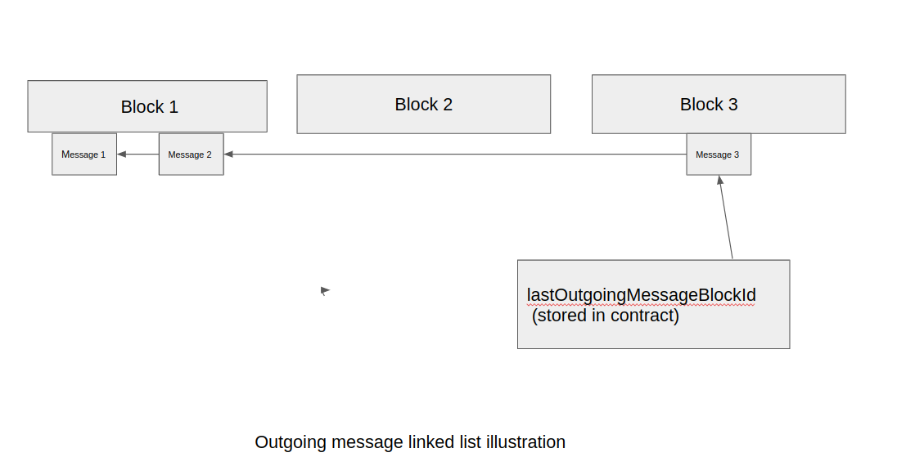

# IMA Linked List Optimization

## 1 TL;DR

### 1.1 Problem

Currently IMA puts lots of computational load on geth by searching history for IMA message events.
This can significantly slow IMA performance and limit the numnber of chains we can run.

### 1.2 Solution

This proposal totally eliminates searches by creating a linked list of IMA messages. 
Each message includes the block number of the previous message.  This glues all IMA messages into a linked list,
where one can easily go back in history.

To find all messages, one starts from the latest message and then goes back in history by traversing the linked list. 
On each step, ```eth_getLoggs``` is called for a single block only.

### 1.3 Gas cost

This spec does not significantly increase gas costs, since existing variables are used and the number of 
SSTORE operations does not change. 

## 2 Illustration




## 3 Proposed changes to IMA contracts

### 3.1 Add lastOutgoingMessageBlockId to ConnectedChainInfo.outgoingMessageCounter


Currently IMA uses ```ConnectedChainInfo.outgoingMessageCounter``` variable which has 256 bits.  Note, that the first 128 bits of this variable are always zero and can be used to store useful data.


_Proposed change:_


A. Use first 128 bits of ```outgoingMessageCounter```  to store ```lastOutgoingMessageBlockId```. This variable will store the block ID of the last outgoing message, which is the head of the linked list.


```ConnectedChainInfo.outgoingMessageCounter = lastOutgoingMessageBlockId || outgoingMessageCounter```


B.  Each time a new outgoing message is received update ```lastOutgoingMessageBlockID``` and ```outgoingmessageCounter```, and then save the 
```ConnectedChainInfo.outgoingMessageCounter``` variable. 

It will require a single SSTORE operation, so the gas costs wont change significantly compared to what IMA has now. 


Note: if IMA did not yet have any outgoing messages , ```lastOutgoingMessageBlockId``` will be zero.


### 3.2 Add previousOutgoingMessageBlockId to event OutgoingMessage.messageCounter


Currently IMA outgoing message event has ```OutgoingMessage.messageCounter``` field, which has 256 bits.  Note, that the first 128 bits of this field are always zero and can be used to store useful data.


_Proposed change:_


A. Use first 128 bits of ```OutgoingMessage.messageCounter```  to store ```previousOutgoingMessageBlockId```. This variable will store the block ID of the previous outgoing message, which will form a link in the the linked list.


```ConnectedChainInfo.outgoingMessageCounter = lastOutgoingMessageBlockId || outgoingMessageCounter```

Note: for the first message , ```previousOutgoingMessageBlockId``` will be zero.


B.  Each time a new outgoing message is received update lastOutgoingMessageBlockID and outgoingmessageCounter, and then save the 
```ConnectedChainInfo.outgoingMessageCounter``` variable. 

Since no new fields are introduced in the event, the gas costs wont change significantly compared to what IMA has now. 


### 3.3 Add separate getter functions for lastOutgoingMessageBlockId and outgoingMessageCounter.


_Proposed change:_


Add separate getter functions for ```lastOutgoingMessageBlockId``` and ```outgoingMessageCounter``` variables. This is to make IMA smart contracts
easy to use by IMA agent.

## Pseudo code of IMA contract operation:

For a new outgoing message:

1. Read and parse ```lastOutgoingMessageBlockId``` and ```outgoingMessageCounter```
2. Increment ```outgoingMessageCounter```
3. Create message event setting ```previousOutgoingMessageBlockId``` to ```lastOutgoingMessageBlockId``` and ```messageCounter``` to ```outgoingMessageCounter```
4. Set ```lastOutgoingMessageBlockId``` to the current block id.
5. Write back ```lastOutgoingMessageBlockId``` and ```outgoingMessageCounter``` 


:
