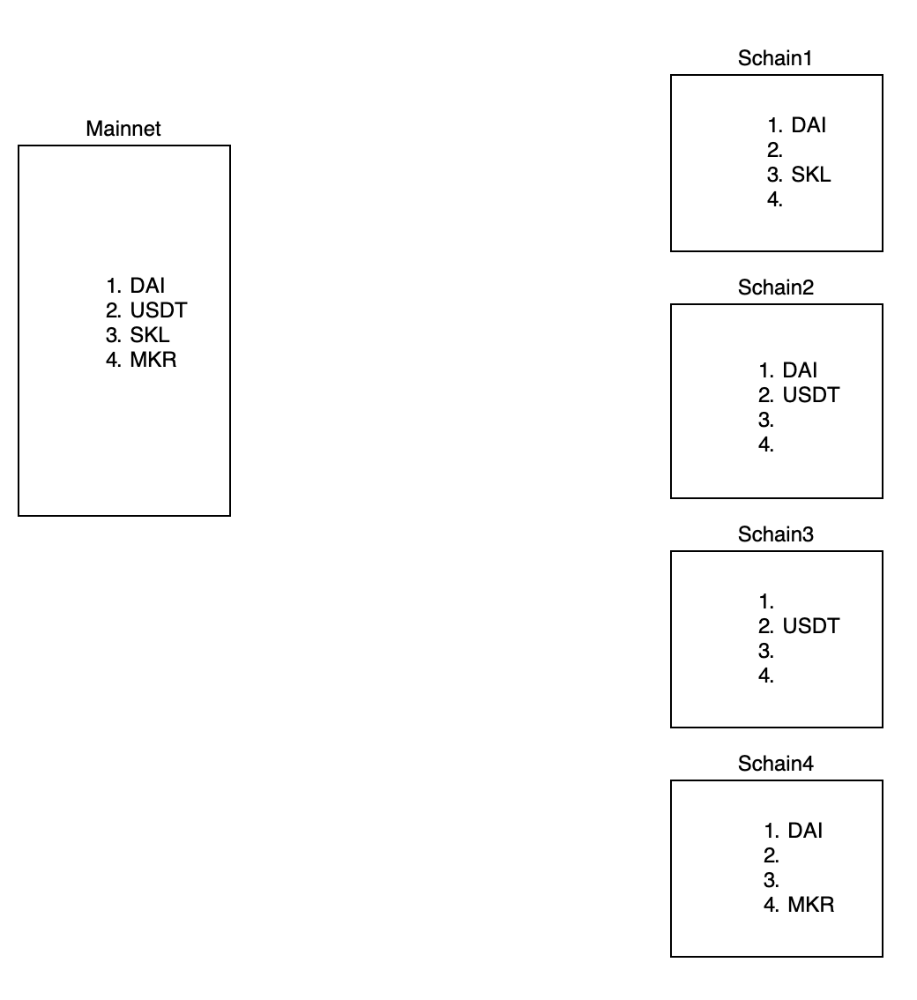

<!-- SPDX-License-Identifier: (AGPL-3.0-only OR CC-BY-4.0) -->

# SKALE IMA token positioning and transfer types

## Overview

In SKALE-IMA there are 2 types of transfers:

-   transfer
-   raw transfer

### Transfer

Transfers an amount of tokens to the contract on a SKALE chain.

If this is first transfer of this token from the mainnet, then the contract should specify a position for this token in the list of tokens.  This then creates a clone with the same ERC20 parameters on the SKALE chain (e.g. name, symbol, decimals and totalSupply if it exists).

For subsequent transfers, the contract knows the position of this token and therefore sends to the same position on the SKALE chain.

In the picture below you could find how is token positioning works through SKALE chains.

### Raw transfer

Transfers an amount of tokens to the specified address of contract on a SKALE chain.

#### Problem

In Raw transfer, the address on the SKALE chain must be specified and IMA smart contracts cannot not remember it. So DAI → MKR with Raw transfer may result in receiving MKR on mainnet.

#### Solution

Add raw transfers to the list of tokens.

If this is the first transfer of the token, then the contract should specify a position for this token. And it would be unavailable to send DAI to something else except to the initial position.
