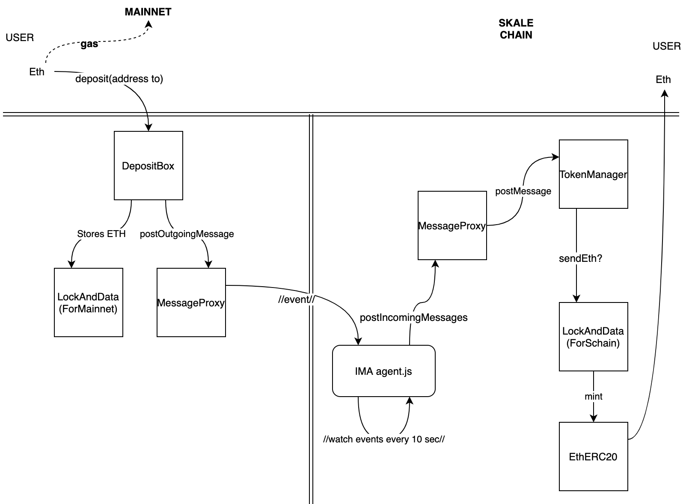
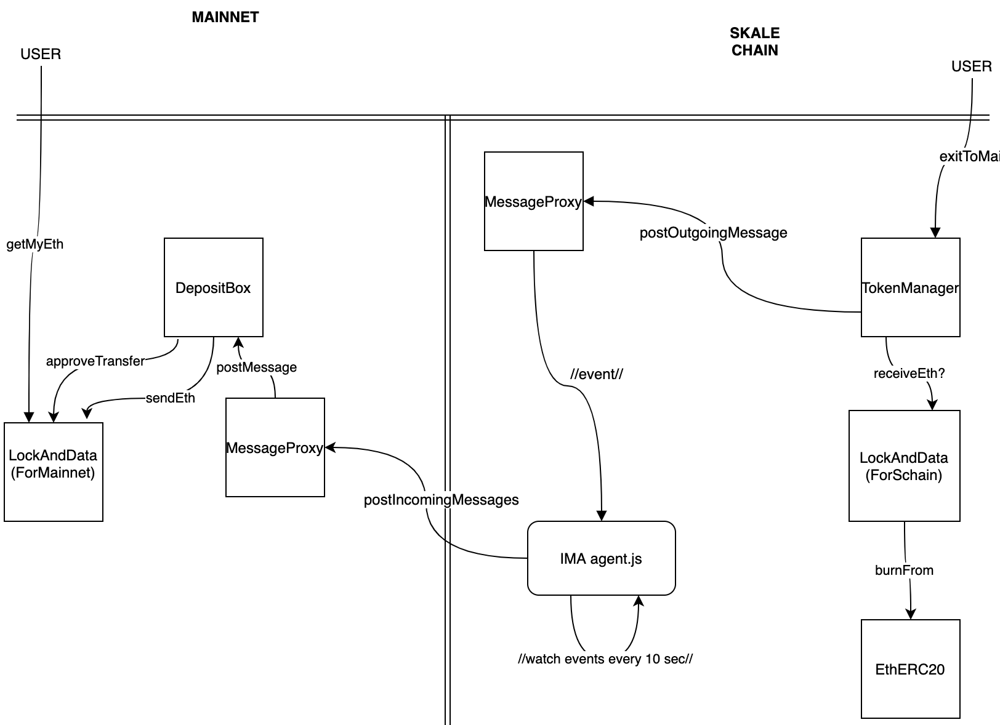
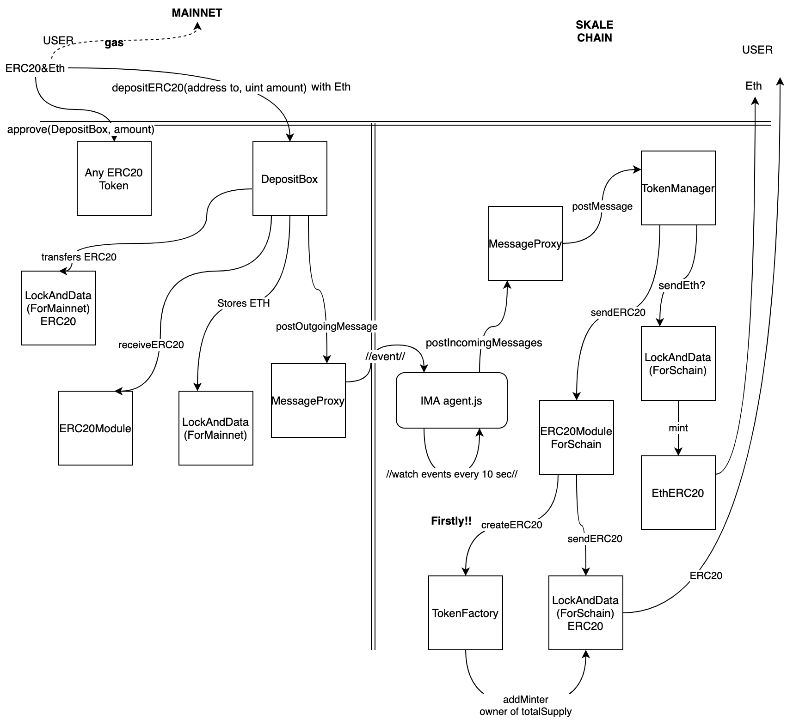
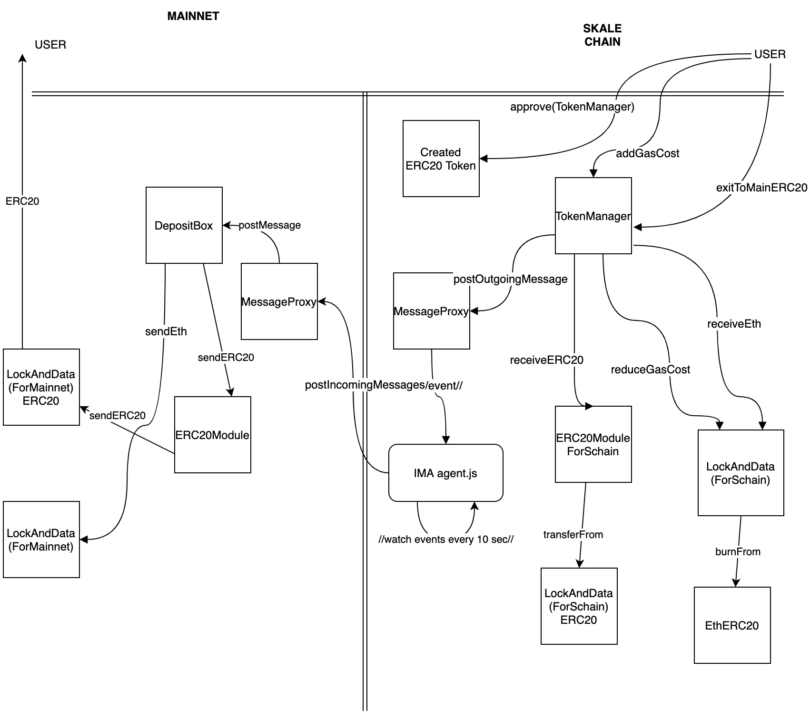

<!-- SPDX-License-Identifier: (AGPL-3.0-only OR CC-BY-4.0) -->

# IMA Transfer flows

## ETH to SKALE chain

## ETH to Mainnet

## ERC20 to SKALE chain

## ERC20 to Mainnet

## ERC721 to SKALE chain

## ERC721 to Mainnet
